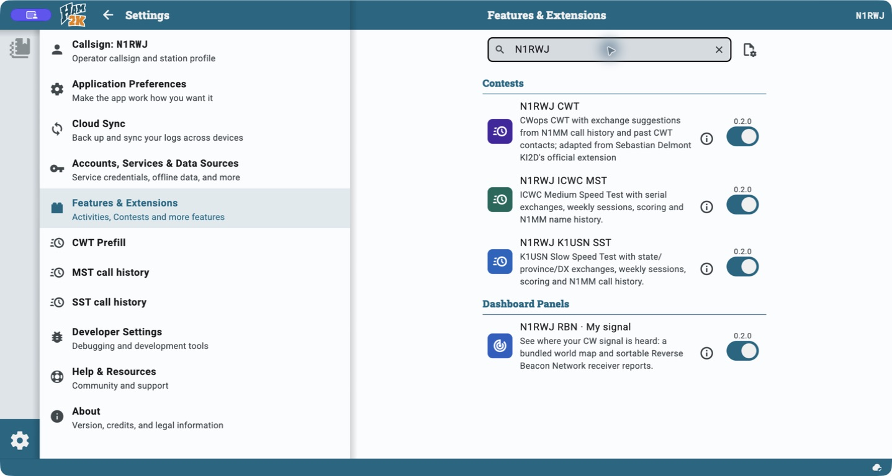

# N1RWJ extensions for Ham2K

Extensions for Ham2K contest logging and seeing where your signal is
heard. Each extension is available as a ready-to-install `.h2kext` bundle;
install only the ones you want.

| Extension | What it adds |
| --- | --- |
| [RBN · My signal](extensions/tools/n1rwj-rbn/README.md) (`n1rwj-rbn`) | Reception map and sortable CW, RTTY, FT8, and FT4 reports from the Reverse Beacon Network via Vail ReRBN, using your operation's callsign and location |
| [CWops CWT](extensions/contests/n1rwj-cwt/README.md) (`n1rwj-cwt`) | CWT sessions, exchange suggestions, scoring, and exports |
| [ICWC MST](extensions/contests/n1rwj-mst/README.md) (`n1rwj-mst`) | MST sessions, name suggestions, outgoing serials, scoring, and exports |
| [K1USN SST](extensions/contests/n1rwj-sst/README.md) (`n1rwj-sst`) | SST sessions, name/location suggestions, scoring, and exports |

## Install

1. Download the bundle for each extension you want from
   [latest GitHub release](https://github.com/rwjblue/ham2k-n1rwj-extensions/releases/latest).
   Choose the `.h2kext` asset whose name starts with the extension key in the
   table above. The matching `.sha256` file lets you verify the download.
2. In Ham2K, choose **Settings → Features & Extensions → Install from file**
   and select the `.h2kext` file. Each bundle installs separately. The host
   must support the hooks and shared-library versions declared in its manifest.

Then follow the steps for the extension below. Building from source is
optional. GitHub downloads and catalog availability are separate; see
[publishing status and recovery](docs/PUBLISHING.md) for the catalog workflow.

After installation, search for **N1RWJ** in **Features & Extensions** to
see the installed extensions and their enable switches. See the
[screenshot record](docs/images/README.md) for the captured app and extension
versions; use the latest release linked above when installing.



### RBN · My signal

The RBN panel requires a Ham2K version with native SVG panel support.
If it shows **App update needed**, update Ham2K before using the panel.
See the [verification record](docs/VERIFICATION.md) for tested builds.

1. Open an operation and choose **Edit Layout → Add a Panel → RBN · My signal**.
   Turn on **Enable Layout Customization** in app settings if layout editing is
   unavailable. On narrow screens, **Edit Layout** is under **Tools**.
2. Leave **Watch callsign** and **Map origin grid** blank to follow the operation.
   The panel uses its station callsign and latitude/longitude, or its grid
   when coordinates are unavailable. Set the operation's location for the
   map, distance, and bearing; the receiver listing works without it.
3. Save the layout. Reports refresh automatically while the panel is visible.
   The defaults show the last 15 minutes on all bands, newest first.

Use panel settings (the tune icon) to choose **View** and **Band**. Use the
panel controls to sort reports, page through receivers, and refresh manually.
Wide panes show a table; narrow panes use receiver cards.
Explicit callsign/grid overrides stay with that panel placement until cleared,
so leave them blank for normal operation. The map geography is bundled; new
RBN reports are provided by Vail ReRBN and need internet access. Receiver positions
use registered grids, so map paths, distances, and bearings are estimates.
See the [RBN guide and historical screenshots](extensions/tools/n1rwj-rbn/README.md)
for settings, test observations, and device-testing limits.

### Contest extensions

1. **For CWT, disable the original CWops CWT extension.** Both handle `cwt`
   references, so enabling both creates duplicate handlers. The personal key,
   saved CWT references, settings, and data-file identity remain compatible
   with previous releases of this repository.
2. Refresh the extension's call-history entry under **Settings → Accounts,
   Services & Data Sources**. Its settings accept an HTTPS N1MM entry or text
   URL; leaving the source blank discovers the current contest-specific file.
3. Add the desired session to an operation, configure your sent exchange,
   and log contacts. Always copy and verify the exchange actually sent.

| Contest | Exchange | Weekly sessions, UTC | Scoring |
| --- | --- | --- | --- |
| CWT | Name and CWops number, CWA, or nonmember location | Wednesday 13:00 and 19:00; Thursday 03:00 and 07:00 | QSOs × unique callsigns across the session |
| MST | Name and sequential QSO number | Monday 13:00 and 19:00; Tuesday 03:00 | QSOs × unique callsigns across the session |
| SST | Name and US state, Canadian province, or DX | Monday 00:00; Friday 20:00 | QSOs × state/province/DXCC multipliers counted once per band |

Every session lasts one hour. These contests use CW on 160, 80, 40, 20, 15,
and 10 meters; each station can be worked once per band. MST encourages
20–25 WPM; SST has a 20 WPM maximum. SST uses `DX` for locations outside the
lower 48 US states and Canada, including Alaska and Hawaii; the lower 48 US
and Canada do not also earn country multipliers. See the sponsors' current
[CWT rules](https://cwops.org/cwops-tests/),
[MST rules](https://internationalcwcouncil.org/mst-contest/), and
[SST rules](https://www.k1usn.com/sst_rules.html). The
[sponsor-linked SST definition](https://n1mmwp.hamdocs.com/mmfiles/k1usnsst-udc/)
specifies per-band multipliers. Calendar suggestions follow the normal weekly
schedule; check sponsor announcements for cancellations or moved sessions.

MST suggests names from history; received serial numbers must be entered for
each contact and are never reused from history or CWops membership data.
Ham2K allocates your outgoing MST serials. SST suggests names and locations.
Explicit edits and intentional clearing take priority. Data downloads occur
during refresh, with the last successful dataset retained after a failed
replacement. No download or full-log read is required for each keystroke.

Use one callsign per contact for these exchange-based contests: batch call
entry shares exchange controls. ADIF and Cabrillo exports preserve the
contest exchange. MST and SST scores are reported through
[3830 Scores](https://www.3830scores.com/); their sponsors do not require log
uploads. The [CWT](extensions/contests/n1rwj-cwt/README.md),
[MST](extensions/contests/n1rwj-mst/README.md), and
[SST](extensions/contests/n1rwj-sst/README.md) operator guides explain each
contest, its data sources, exchange suggestions, and scoring, including how
MST serial numbers work. [Verification](docs/VERIFICATION.md) separates
automated checks from tests performed in the native Ham2K app.

## Develop

Install [mise](https://mise.jdx.dev/) and use its executable file tasks:

```sh
mise run install
mise run extension:list
mise run format
mise run check
```

`check` runs lint, strict TypeScript checking, Vitest, the official extension
build, and official package validation. CI runs the same task. Individual
tasks are `lint`, `typecheck`, `test`, `build`, and `pack`:

```sh
mise run build n1rwj-mst
mise run pack n1rwj-sst
mise run test -- extensions/contests/n1rwj-cwt/tests
mise run verify-host n1rwj-mst
mise run verify-host --app "/Applications/Ham2K Mac Logger (Next).app"
```

Omit the extension key to build, package, or verify all extensions. `pack`
builds the workspaces and writes the selected archives and checksums to
`dist/`. `verify-host` evaluates bundles against the running or newest
installed macOS Ham2K JavaScript kernel; it does not substitute for native
installation and logging tests.

```text
extensions/contests/n1rwj-cwt/   CWT manifest, source, and tests
extensions/contests/n1rwj-mst/   MST manifest and configuration
extensions/contests/n1rwj-sst/   SST manifest and configuration
extensions/tools/n1rwj-rbn/     RBN reception map, reports, and bundled geography
packages/n1mm/                 Generic N1MM parsing, callsigns, and downloads
packages/contest-history/      Shared CWT/MST/SST operation-history adapter
packages/mini-contest/          Shared MST/SST hooks, history, scoring, and tests
mise/tasks/                    Executable automation and its TypeScript config
scripts/                       TypeScript implementation of repository tooling
```

Node 24 runs TypeScript automation directly with built-in type stripping.
Type checking is a separate required step; use erasable syntax, explicit
`.ts` imports, and type-only imports. Extension source still needs the
official Ham2K build preset: the host runs an ES2020 JavaScript sandbox without
Node, DOM, or global `fetch`. Read the installed SDK's `AGENTS.md`, relevant
`docs/`, and published `dist/index.d.ts` before changing hooks. Host-provided
shared libraries stay declared in each manifest and externalized from bundles;
local installations of those libraries are development dependencies.

### Add an extension

```sh
mise run extension:new n1rwj-notes --name "N1RWJ Notes"
mise run extension:new n1rwj-example --name "Example Contest" --group contests
mise run check
```

The generator creates a typed panel extension, manifest, package, Vitest
test, and README, then updates the workspace lockfile. The default group is
`dashboards`; `--group` chooses a directory, while the generated hook remains
a panel until you adapt it. It refuses invalid/reserved keys and existing
extensions. Update the manifest's category and hooks when changing the
extension type. New workspaces are discovered automatically by build, check,
packaging, and release tasks.

Keep reusable parsing independent of contest meaning. For example, N1MM's
`Exch1` contains a CWT membership/location exchange or an SST location;
neither is an MST serial number. New substantive behavior needs deterministic
Vitest tests. The repository uses the user's Jujutsu workflow and
`commit-message-default: auto` in [AGENTS.md](AGENTS.md).

### Keep CWT aligned upstream

The personal CWT extension is temporary, pending
[Ham2K/extensions PR #1](https://github.com/ham2k/extensions/pull/1).
MST, SST, RBN, and future extensions will continue to live in this repository.

While the personal CWT extension is in use, synchronize CWT behavior, fixes,
tests, translations, and relevant documentation with the source branch of
[PR #1](https://github.com/ham2k/extensions/pull/1), currently
`codex/cwt-call-history` in `~/src/github/ham2k/extensions`. Its CWT source is
`extensions/contests/ham2k-cwt/`. Verify the current PR branch before editing
and run upstream checks. This also applies to shared changes affecting CWT.
Backport relevant upstream fixes here, preserving personal identity and saved
data. MST, SST, RBN, monorepo tooling, and personal packaging are independent of
that CWT synchronization requirement.

## Release

All extensions and shared workspaces use one synchronized repository version.
Choose an unused version; `0.3.3` is the prepared candidate:

```sh
mise run release:prepare 0.3.3
mise run format
mise run release v0.3.3 --dry-run
```

`release:prepare` updates the root package, every extension's manifest and
package, shared packages, and lockfile. `release --dry-run` runs `check` and
validates matching versions and SHA-256 files without uploading anything.
Commit the prepared files, push, then publish a GitHub release tagged with
that version at the tested commit.

The **Release** workflow responds to published releases and prereleases,
checks out the tagged commit, and runs `mise run release`. It attaches only
the current extensions' exact `<key>-<version>.h2kext` and `.sha256` pairs;
unrelated or older files in `dist/` are excluded. The same task can attach
assets to an existing release locally. It uses GitHub's built-in CI token and
refuses to overwrite existing assets. Draft releases do not trigger uploads.
Keep release immutability disabled while using this workflow because assets
are attached after publication. After an interrupted upload, inspect the
existing assets before retrying.

After uploading assets, a separate job attempts to submit the same bundles to the
Ham2K catalog for review. See [Publishing](docs/PUBLISHING.md) for token
setup, channel selection, submission status, and recovery from failures.

## Credits and license

The CWT extension builds on Sebastian Delmont's (KI2D) original Ham2K CWT
extension. Its MPL-2.0 license and copyright notices are retained. See
[provenance](docs/PROVENANCE.md), [license](LICENSE), and [notices](NOTICE.md)
for source history and attribution.

The RBN map bundles Natural Earth geometry and projection libraries with
their notices. See its [map attribution](extensions/tools/n1rwj-rbn/assets/MAP_ATTRIBUTION.md)
for the data source and licenses.
