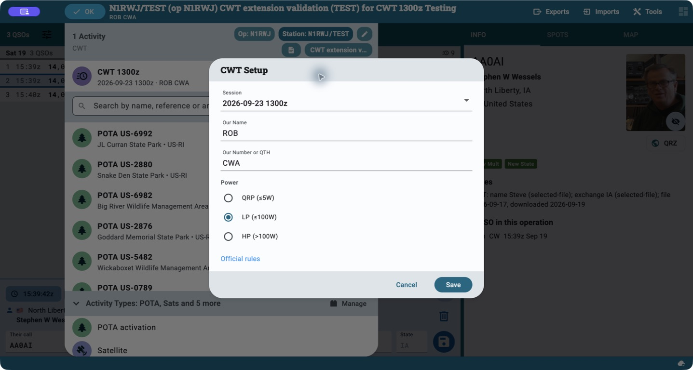
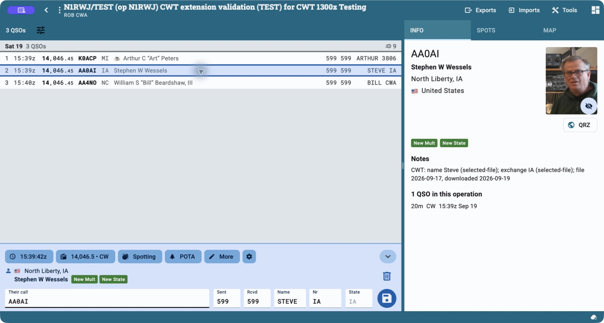

# N1RWJ CWT for Ham2K

Log the **CWops Tests (CWT)** in Ham2K with session selection, exchange
suggestions, scoring, and ADIF/Cabrillo exports. The extension suggests names
and CWops numbers or locations from a downloaded call-history file and your
previous CWT contacts, while preserving what you actually enter.

Part of the [N1RWJ contest extensions](../../../README.md#contest-extensions):
**CWT** · [MST](../n1rwj-mst/README.md) · [SST](../n1rwj-sst/README.md).

## The contest at a glance

[CWops CWT](https://cwops.org/cwops-tests/) is a series of short CW operating
events, open to members and nonmembers alike. Each one-hour session is a
separate event.

| Detail | CWT |
| --- | --- |
| Sessions, UTC | Wednesday 13:00 and 19:00; Thursday 03:00 and 07:00 |
| Mode and bands | CW on 160, 80, 40, 20, 15, and 10 meters |
| Exchange | First name + CWops member number; nonmembers send state, province, or DX country prefix |
| Example | `ART 3806` for a member, or `ROB RI` for a nonmember in Rhode Island |
| Score | QSO points × unique callsigns across all bands |

Eligible CW Academy participants can use `CWA` as described in the
[official rules](https://cwops.org/cwops-tests/). A CWops number is a fixed
membership number: **CWT does not use a sequential contact serial number**.
The extension suggests the regular weekly schedule; check the sponsor's page
for special sessions or schedule changes.

## Get started

1. Download `n1rwj-cwt-<version>.h2kext` from
   [latest GitHub release](https://github.com/rwjblue/ham2k-n1rwj-extensions/releases/latest)
   and install it through **Settings → Features & Extensions → Install from file**.
2. **Disable the original CWops CWT extension.** Enable only one CWT extension
   so Ham2K has one set of exchange controls and scoring rules.
3. Create an operation for the session, add CWT, and select the correct UTC
   date/time. Set your sent first name, member number or location (or eligible
   `CWA` exchange), and power class.
4. Under **Settings → Accounts, Services & Data Sources**, refresh
   **CWops CWT call history (N1RWJ)** before operating.
5. Enter a callsign, listen to the exchange, and confirm or correct the
   suggested **Name** and **Nr** values before saving.

Use a separate operation for each session and log **one callsign at a time**;
batch call entry shares the exchange fields. Use **Wipe** to start a fresh
contact and reset any edits left in the controls.

## In Ham2K

Open the operation title, then **Edit activity** beside CWT to choose the
UTC session, your sent name/number or location, and power class.

The logging view adds **Name** and **Nr** beside the normal contact fields.
Here the selected test contact has `STEVE IA`; the log also shows a member
number and a `CWA` exchange. The **Info** pane identifies the call-history
source, and the log header shows the score.

These native macOS screenshots use a **Testing** operation with synthetic
contacts. See the [screenshot record](../../../docs/images/README.md) for
capture versions; the dates and exchanges shown are examples.

## Where the call history comes from

The default source is the public
[N1MM call-history collection](https://n1mmwp.hamdocs.com/mmfiles/categories/callhistory/).
The extension discovers the latest listed `CWOPS_*.txt` file, which contains
names and known CWT exchanges. See N1MM's
[call-history explanation](https://n1mmwp.hamdocs.com/setup/call-history/)
for background on these community-maintained files. They are suggestions,
not a live membership check or a guarantee of today's exchange.

Ham2K checks the data when it loads the extension and when it reconnects,
downloading a missing file or refreshing one older than 24 hours. You can
also refresh it manually. **CWT Prefill** settings show the file's source,
date, download time, record count, and any warnings. Leave the source blank
for automatic discovery, or choose an HTTPS N1MM file page or direct text
URL, then refresh. Local file paths are not supported.

Typing a callsign uses the downloaded data and your local history; it does
not download the N1MM file for every contact. The native app keeps the last
successful file across restarts and failed refreshes, so cached suggestions
remain available without a new download. See the
[verification record](../../../docs/VERIFICATION.md) for tested offline/cache
behavior and its limits.

## How exchange suggestions work

Your edits, including deliberately cleared fields, take priority. For each
untouched field, the extension looks for a value in this order:

1. CWT contacts already saved in this operation.
2. The downloaded N1MM CWT file.
3. Your older CWT contacts.
4. Ham2K's ordinary name or location suggestion.

Name and number/location are resolved separately. Within each source, exact
callsign matches come first. An unambiguous base call can supply a portable
station's name, member number, or `CWA`; a stored nonmember location requires
the exact call because the station may have moved.

If no CWT exchange is known, **Nr** may suggest a state or country prefix.
That is only a location guess: a missing file entry or member number does
not establish that someone is a nonmember. Check what they send. A suggestion
is saved if you leave it unchanged; clearing or correcting it is respected.
For the full matching rules, see [call-history details](../../../docs/CALL-HISTORY.md).

## How scoring works

Each eligible contact earns **one point**, and you may work a callsign once
on each contest band. The multiplier is the number of **different callsigns
across the whole session**. Working the same station on a second band adds
a point, but does not add another multiplier. For example, 10 contacts with
8 different callsigns score **10 × 8 = 80**.

Duplicate contacts on the same band, non-CW contacts, and contacts on other
bands earn no points. The current CWT scorer does **not** independently
exclude contacts outside the selected hour or reject incomplete exchanges.
Keep each operation confined to its session and review the exchange fields
before reporting your score; a displayed score is not a completed-log check.

## Export and report your score

Use Ham2K's **Exports** menu for ADIF or Cabrillo. CWT exports use the
`CWOPS-CWT` contest identifier and retain your sent and received exchanges.
Report your session total at [3830 Scores](https://www.3830scores.com/), as
described by CWops; routine CWT participation does not require a log submission.

## About this extension

This independent adaptation is based on the official CWT extension by
**Sebastian Delmont, KI2D**, the main Ham2K developer. His attribution and
MPL-2.0 notices are preserved; see [provenance](../../../docs/PROVENANCE.md),
[license](../../../LICENSE), and [notices](../../../NOTICE.md).

Only this personal CWT extension is temporary, pending
[Ham2K/extensions PR #1](https://github.com/ham2k/extensions/pull/1); the N1RWJ
repository and the other extensions are permanent. CWT behavior and relevant
documentation are kept aligned with that PR. Existing CWT operations,
settings, and cached data are retained when updating this extension.

See the [installation and development guide](../../../README.md),
[upstream synchronization guidance](../../../README.md#keep-cwt-aligned-upstream),
and [verification record](../../../docs/VERIFICATION.md). To build just CWT,
run `mise run pack n1rwj-cwt` from the repository root.
