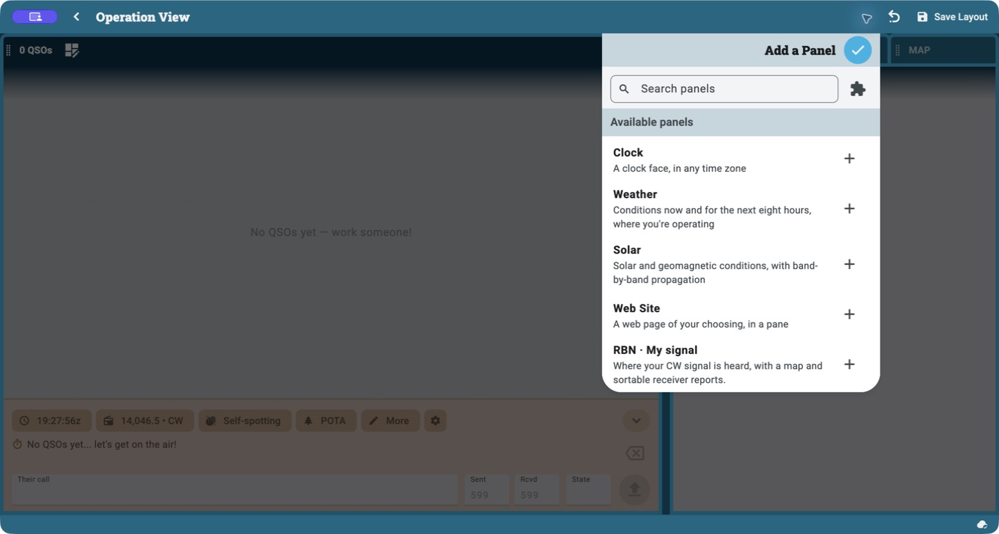
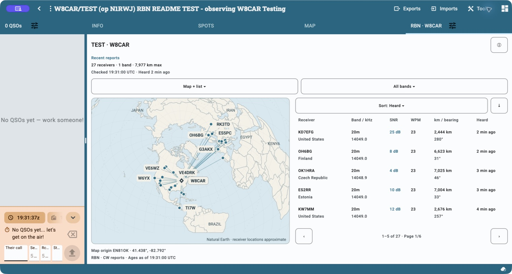
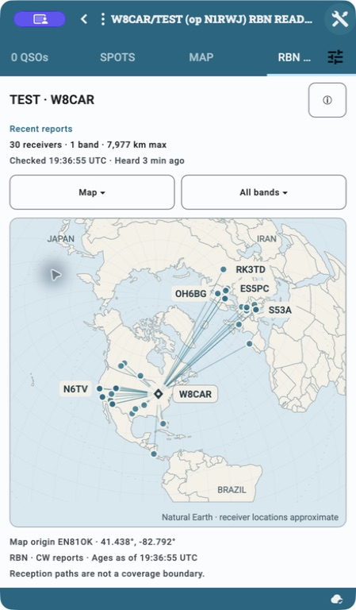
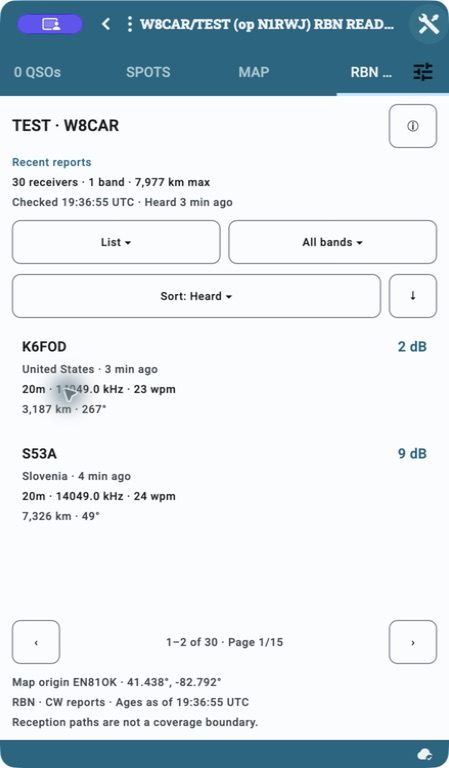
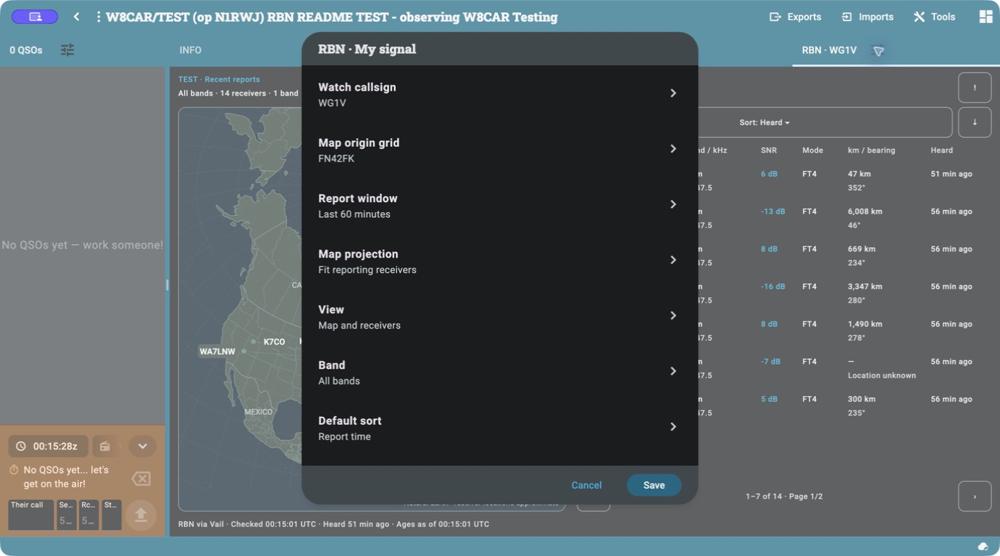

# N1RWJ RBN

See where the [Reverse Beacon Network](https://www.reversebeacon.net/) has
heard your CW, RTTY, FT8, and FT4 signals, with a reception map and sortable
receiver reports provided by [Vail ReRBN](https://vailrerbn.com/).
The panel automatically follows your operation's station callsign and location.
It is read-only: it does not transmit, spot a station, post to POTA, or create
contacts.

Part of the [N1RWJ extension family](../../../README.md).

## Find stations in Spots

Enable **N1RWJ RBN** and select **RBN** in the native Spots source filter.
Open **Settings → RBN** to choose:

- **Call-history filter:** CWT is selected by default when installed. Choose
  MST, SST, or **All calls** explicitly. A selected missing extension or file
  produces no spots, with an explanation in RBN settings. An explicit choice
  survives restarts; filters do not switch automatically with the operation.
- **Spot mode:** CW (default), RTTY, FT8, or FT4.
- **Only these skimmers:** exact IDs, including suffixes such as `KM3T-5`.
- **Receiver grid regions:** Maidenhead prefixes, for example `FN, EM`, `JO`,
  or `FN42`. These select the receiving skimmers, not the spotted stations.
- **Receiver continents:** select one or more continents; no selection allows
  all. Uses the receiver's continent from the RBN directory. Refresh that data
  file after upgrading to populate this field in older caches. Unknown
  continents are excluded only while this filter is enabled.
- **Distance origin grid:** your 4, 6, or 8 character grid, such as `FN42FK`.
  This explicit origin is shared across operations; update it when you move.
- **Maximum receiver distance (miles):** a positive distance, such as `250`.
  Leave blank for no limit. Set the origin first; clear the limit before
  clearing its origin. Distances use the great-circle path between grid centers.

Separate skimmers or regions with spaces or commas. Blank means unrestricted.
Every enabled filter must match; multiple entries within a filter are alternatives.
Receiver selection happens
before reports are collapsed to the newest station/band/mode observation.
Regions use the cached RBN directory grid first, then the report grid; unknown
locations are excluded when a region or distance limit is selected. Locations are approximate,
and reception by a nearby skimmer does not guarantee reception at your station.
These receiver filters remain RBN responsibilities when native contest-relevance
filtering replaces the temporary call-history bridge. The logger's native
continent filter applies to the spotted station, independently of these controls.

Reports cover ten minutes on 160, 80, 40, 30, 20, 17, 15, 12, and 10 meters.
Each refresh is capped at two pages of 1,000 reports per band; a busy band can
exceed this snapshot, particularly with digital modes. Requests are coalesced
and cached for at least a minute. Both Spots and My Signal honor shared API
rate-limit backoff. Offline or failed refreshes use only unexpired cached
reports, reapplying current filters. Settings apply on the next Spots refresh.

CWT, MST, and SST provide membership from their cached call-history files via
[the shared filter contract](../../../packages/spot-filters/README.md).
They do not fetch reception reports or expose exchange data. File membership
does not prove participation in the current contest. Band, age, mode, and
source controls in the native Spots panel further narrow these results.

## Install and open the panel

1. Use a Ham2K version with native SVG panels. If the panel shows
   **App update needed**, update Ham2K before using it.
2. Download `n1rwj-rbn-<version>.h2kext` from the
   [latest GitHub release](https://github.com/rwjblue/ham2k-n1rwj-extensions/releases/latest).
3. In Ham2K, open **Settings → Features & Extensions → Install from file**
   and select the downloaded package.
4. Open an operation, choose **Edit Layout → Add a Panel → RBN · My signal**,
   and save the layout. On narrow layouts, **Edit Layout** is under **Tools**.
   If editing is unavailable, enable **Enable Layout Customization** in settings.
5. Leave **Watch callsign** and **Map origin grid** blank to follow the operation.
   Reports load automatically when the panel is visible.

No build tools, map accounts, or custom Ham2K build are required.

## In Ham2K

Installing the extension makes **My Signal** available in the operation's
**Edit Layout → Add a Panel** menu. Choose its **+** button, place it in your
layout, and save.

The panel then appears alongside your other operation panels. This desktop
example shows the reception map and receiver table together:

Narrow layouts can show the map or receiver cards separately:

| Map view | Receiver list |
| --- | --- |
|  |  |

These native macOS screenshots show the compact layout in the local **0.3.2**
candidate, with live Vail ReRBN reports for WG1V observed from an empty TEST
operation. The candidate is not a published release artifact. The compact
examples use a narrow desktop window, not a phone. See the
[screenshot record](../../../docs/images/README.md) for capture versions and
the [verification record](../../../docs/VERIFICATION.md) for runtime coverage.
Physical phone and Linux runtime checks remain outstanding.

## Configuration is optional

The operation provides the defaults. Open the tune button beside the panel title
to change its settings; they are also available in **Edit Layout**.
**View** and **Band** live here to leave more room for the map.

| Setting | With the default settings | Optional change |
| --- | --- | --- |
| **Watch callsign** | Uses the operation's station callsign | Watch another exact callsign |
| **Map origin grid** | Uses the operation's latitude/longitude, otherwise its grid | Use a 4, 6, or 8 character Maidenhead locator |
| **Report window** | Last 15 minutes | Last 30 or 60 minutes |
| **Band** | All bands | Select one band |
| **View** | Map and receivers | Map or receivers only |
| **Default sort / direction** | Newest reports first | Receiver, SNR, distance, frequency, or CW speed; either direction |
| **Map projection** | Fit reporting receivers | From my station · distance rings |

The callsign is the operation's **station** callsign, which can differ from the
operator's callsign. If the operation has multiple comma-separated station
callsigns, the panel uses the first. Portable suffixes match exactly: `K1ABC`
and `K1ABC/P` are different watched callsigns. The band selection does not
automatically follow the operation's active band.

With both overrides blank, switching operations follows the new station and
location. An explicit override stays with that panel placement until you clear
it, including when its layout is used for another operation. A callsign override
does **not** look up or change the map origin; set the corresponding grid when
watching a station elsewhere.

If the operation has no location, the receiver list still works. The map asks
for an operation location or grid override, and distance and bearing remain
unavailable. The extension never substitutes a callsign-prefix location guess.
If no valid callsign is available, it prompts for one without requesting reports.

View and band are saved per panel placement through the tune settings and survive
refreshes, operation changes, and restarts. Saving a different band keeps the
selected view. In-panel sort choices survive refreshes and unrelated settings
changes, and reset when switching operations or restarting the extension.
Changing a saved sort default applies to that control only. Changing settings
returns to the first page.

## Map and receiver list

The map marks your station with a diamond and reporting receivers with circles.
Reception paths show where your signal was heard. Regional maps include
state/province boundaries and sparse country labels; light and dark colors keep
land and water distinct. Labels adapt to the available space, with receiver
callsigns taking priority over geographic captions.
Choose **Fit reporting receivers** in panel settings for a regional view or
**From my station · distance rings** for a view centered on your station.
The map includes the selected band's located receivers across all list pages.
Receiver positions come from RBN node grids, with registered grids as a fallback, and may differ from the actual
skimmer location. Receivers without a valid grid remain in the list.

Use **View** in the panel's tune settings to choose **Map and receivers**, **Map**,
or **Receivers**, and **Band** to select a supported band or **All bands**, even
before reports arrive. The panel keeps a compact status and band summary above
the map, with report timing, map origin, and provenance in **Details** (ⓘ or !).
The list
contains the latest report from each receiver on each band and mode: mode,
frequency, SNR, CW speed
(for CW only), age, and—when
locations are available—estimated distance and bearing. The **Sort** menu offers **Heard**,
**Receiver**, **SNR**, **Distance**, **Frequency**, and **CW speed**. The adjacent
direction button reverses the order; missing measurements stay last. Previous
and next buttons move between pages, with the visible range and total count
shown below the reports.

Narrow panels show receiver cards; sufficiently wide panels put the map and
table side by side. Page size follows the available height and text size.
In a short pane, choose **Map** or **List** to give that view more room. The
information button opens **Report details** with timestamps, origin, source
attribution and warnings. Long details are paginated too.

## Refreshes and interpreting reports

While visible, the panel requests a scheduled render every 60 seconds and
automatically checks Vail ReRBN at most once per minute for each
callsign/report-window combination.
Multiple panels watching the same query share results. Switching away does not
clear that cache: returning less than 60 seconds after the last request reuses
the reports. The cooldown starts at the request, not at the last tab visit.
Changing the callsign or report window can request a different snapshot immediately.

Use **↻** beside the Details button to check manually without waiting for the
next automatic refresh. It shares the same cache and waits at least 30 seconds
between requests for the same query; earlier taps reuse the cached reports.
The host disables scene buttons while the refresh action is pending. Refreshing
preserves your view, band, sort, and page, and the icon uses the existing status
row without taking space from the map. Offline state and server rate-limit
backoff still apply.

Ham2K suppresses repeat renders behind another dock tab and while the app is
hidden or paused; the extension has no independent polling timer. A panel that
starts behind another tab makes no request until selected. An already-started
render/request can finish after hiding, and the inspected host allows an initial
render of a selected panel even when the app is hidden. A desktop window merely
losing focus is still considered visible. See the
[host verification and limits](../../../docs/RBN-SVG-MIGRATION.md#why-the-refresh-model-works).

The SDK does not expose device battery level, charging state, or Low Power Mode,
so the extension cannot automatically adapt the interval to those conditions.
A failed refresh retains cached reports within the selected
time window and marks the failure. Reports expire as they age; the in-memory
cache does not survive an extension restart. A successful check with no reports
is different from a failed check. **Checked** and **Heard** show when data was
fetched and when your signal was last reported.

The simplified world geography is bundled in the package, so the map needs no
tile downloads or internet connection. New reception reports need internet
access. See [map attribution and licenses](assets/MAP_ATTRIBUTION.md).

Reports come from the documented [Vail ReRBN HTTP API](https://vailrerbn.com/docs/endpoints)
at `https://vailrerbn.com/api/v1/spots`. Vail ReRBN receives both RBN streams:
CW/RTTY and FT8/FT4. Each check requests up to 500 recent reports within the
selected time window. The API searches partial callsigns; the panel keeps only
exact matches, including portable suffixes. If the API reports additional
matches beyond the returned rows, the panel warns that reports may be missing.
Band filtering and sorting reuse the fetched reports. If the service is
unavailable, the panel shows the failure and any unexpired cached reports.
Rate-limit responses pause requests across all panels until the retry delay
has passed.

Receiver positions and countries come from the public [RBN node directory](https://www.reversebeacon.net/nodes/),
matched by full receiver callsign, including skimmer suffixes. Ham2K downloads
and caches this as **RBN receiver directory** in **Settings → Data Files**.
The file becomes eligible for refresh after seven days, on the host's next
data-file sync (such as startup or reconnection); it is not a weekly timer.
Use Data Files settings to refresh sooner when a receiver is new or moves.
The saved directory loads offline, failed downloads or invalid data retain the
last good cache, and nodes absent from a later response are retained within a
10,000-node limit. Directory updates apply to already-cached reports on the
next panel render. The panel's refresh button refreshes reports only.

Without a usable directory grid, positions fall back to `spotter_grid` supplied
by Vail ReRBN, which comes from the callsign's HamDB registered grid. It can
differ from the actual receiving location, especially for remote receivers. Map positions,
distances, and bearings are estimates. Missing or invalid grids leave receivers
in the list without a map point, distance, or bearing; the extension never
substitutes a callsign-prefix location.

SNR depends on each receiver's antenna and noise environment; comparisons at
the same receiver, band, and mode are most useful. Reception paths do not outline a
coverage boundary, and no recent reports do not establish a transmitter problem.
CW, RTTY, FT8, and FT4 reports are included without a mode filter. WSPR is not
provided by this source.
This version focuses on your signal; it does not add a hunting feed or a
native Spots source.

## Try it without transmitting

1. Choose a currently active CW station from the public
   [POTA spots](https://pota.app/) and note its reported grid or location.
   An active POTA spot does not guarantee a recent RBN report.
2. Create a separate, empty test operation with a station callsign such as
   `K1ABC/TEST` and a title such as **RBN TEST — observing K1ABC**.
3. Add the panel and set **Watch callsign** to the real public callsign, such
   as `K1ABC`. Set **Map origin grid** to that station's reported grid, or give
   the test operation that location. Keep the operation's `/TEST` marker; the
   panel displays a test notice identifying whose reports it is observing.
4. Inspect the map and list. Keep this observation operation empty, without
   logging fictitious contacts or using spot/CQ posting controls.

The examples are placeholders; choose a station active at the time of testing.
For building from source, static previews, native acceptance steps and the
earlier HTML investigation, see the
[development and migration notes](../../../docs/RBN-SVG-MIGRATION.md).
